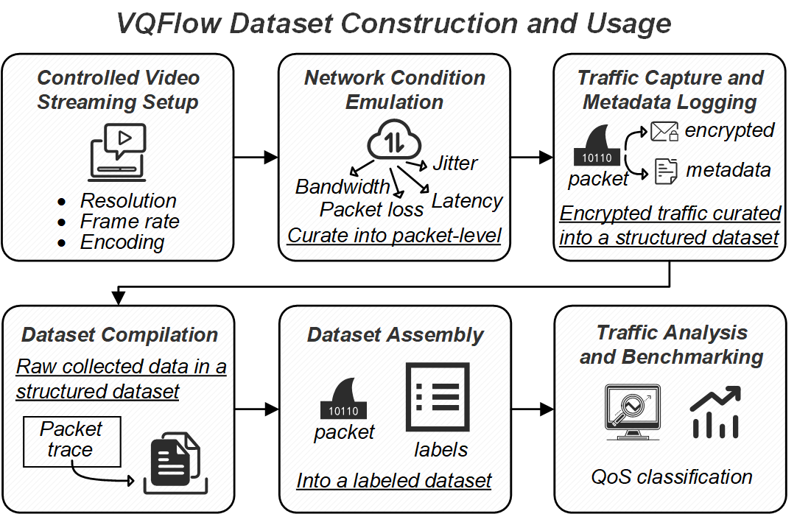
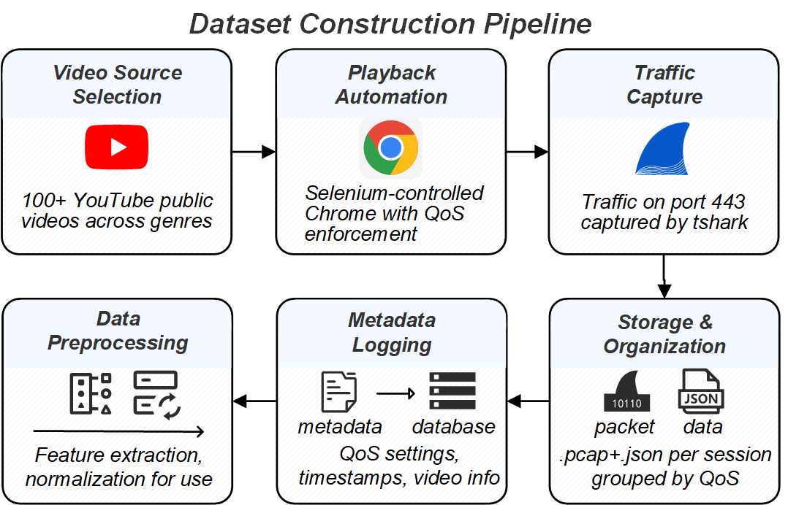
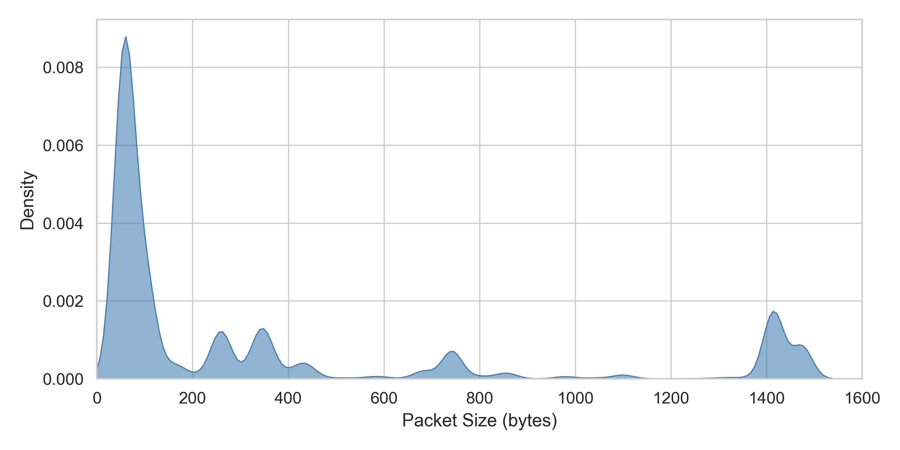
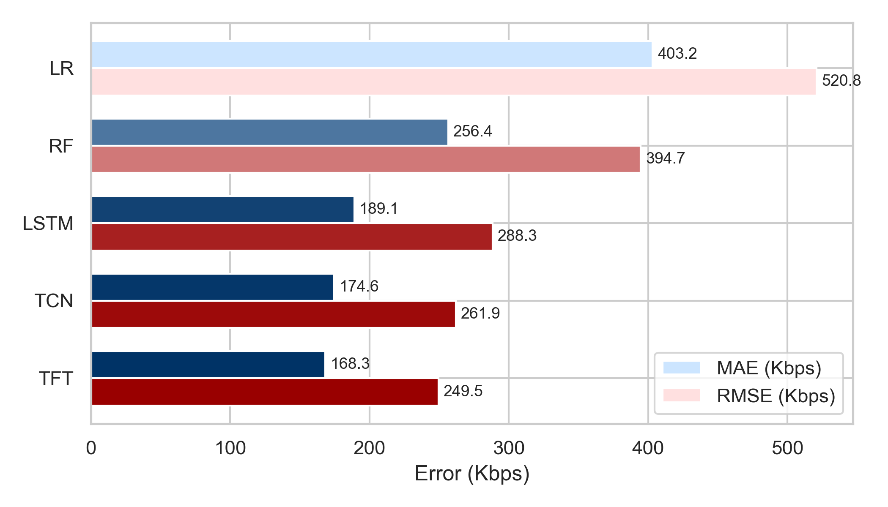
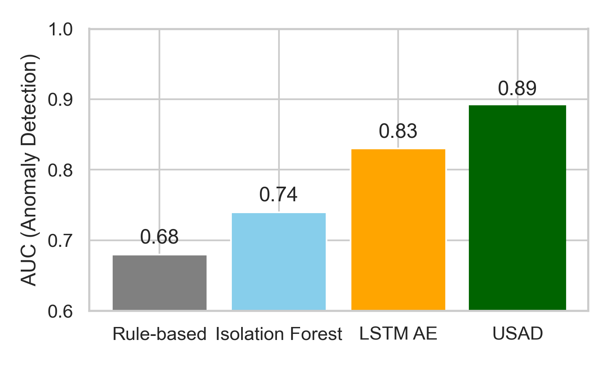

# VQFlow: A Benchmark Dataset for Encrypted Video Streaming Traffic across QoS Configurations

Understanding video streaming traffic behavior under varying Quality of Service (QoS) configurations is critical for optimizing network performance and enhancing user experience. We present VQFlow, a comprehensive dataset that systematically captures encrypted video streaming traffic traces with controlled variations in key QoS parameters, including resolution, frame rate, and bitrate. Unlike existing datasets, VQFlow provides fine-grained ground truth annotations aligned with video playback, enabling detailed analysis of the impact of QoS settings on traffic characteristics. 



## Requirements

```bash
pip install Pillow
pip install torch
pip install numpy
pip install pandas
```

## Dataset Construction Pipeline

To ensure consistent and reproducible data collection, we implement an automated video harvesting pipeline using Python, Selenium, and tshark. The system orchestrates video playback and concurrent traffic capture under predefined Quality of Service (QoS) settings. 



## Dataset Analysis and Characteristics

We examine the distribution of packet sizes across the entire dataset. The packet length dataset is stored in ./csv/ folder. As depicted in the below Figure, the traffic is predominantly bimodal: most packets fall into two distinct clusters, small packets below 100 bytes, typically corresponding to TCP control, TLS handshake, or segment requests, and large packets close to the Maximum Transmission Unit (MTU) size (approximately 1500 bytes), corresponding to video segment payloads. 



## Benchmarking

We report classification accuracy on two tasks. The task 1 refers to multi-dimensional QoS classification and we formulate multi-label classification to jointly predict. The task 2 refers to video title classification across QoS variants. This task evaluates whether video content identity (title index) can be inferred from encrypted traffic across different QoS settings. We fix a set of $N=100$ titles, each watched under various resolution/bitrate/framerate combinations. In the below Table, Transformer-based models (e.g., ET-BERT) show strong generalization across both tasks due to their ability to capture temporal and contextual dependencies in packet streams. 

| **Model**                             | **QoS Classification** | **Title Classification** |
|--------------------------------------|-------------------------|---------------------------|
| BeautyBurst  | 86.4%                  | 71.2%                    |
| BPP-NN     | 88.1%                  | 73.5%                    |
| ITP-KNN      | 85.2%                  | 68.9%                    |
| MarkovChain  | 87.6%                  | 70.4%                    |
| EVS2vec   | 90.7%                  | 76.1%                    |
| FlowPrint  | 83.9%                  | 69.7%                    |
| ET-BERT      | 93.4%              | 79.5%               |

The below Figure reports both Mean Absolute Error (MAE) and Root Mean Squared Error (RMSE) of the bitrate predictions. Among all models, the Temporal Fusion Transformer achieves the lowest error, with a MAE of 168.3 Kbps and RMSE of 249.5 Kbps. This suggests that attention-based models are highly effective in modeling complex burst and pacing structures of encrypted video traffic.



The below Figure summarizes the anomaly detection performance. Deep learning methods significantly outperform traditional approaches, with USAD achieving the highest AUC of 0.89, demonstrating strong capability in identifying subtle QoS-induced anomalies from encrypted traffic. The LSTM AutoEncoder also performs well, while rule-based and Isolation Forest approaches show limited sensitivity due to their simplistic or shallow modeling.




### References
- [FlowPrint: Semi-Supervised Mobile-App Fingerprinting on Encrypted Network Traffic](https://www.ndss-symposium.org/ndss-paper/flowprint-semi-supervised-mobile-app-fingerprinting-on-encrypted-network-traffic/), Thijs van Ede, Riccardo Bortolameotti, Andrea Continella, Jingjing Ren, Daniel J. Dubois, Martina Lindorfer, David Choffnes, Maarten van Steen, Andreas Peter - NDSS 2020
- [ET-BERT: A Contextualized Datagram Representation with Pre-training Transformers for Encrypted Traffic Classification](https://dl.acm.org/doi/10.1145/3485447.3512217), Xinjie Lin, Gang Xiong, Gaopeng Gou, Zhen Li, Junzheng Shi, Jing Yu - WWW 2022
- [Beauty and the burst: Remote identification of encrypted video streams](https://www.usenix.org/conference/usenixsecurity17/technical-sessions/presentation/schuster), Roei Schuster, Vitaly Shmatikov, Eran Tromer - USENIX Security 2017
- [EVS2vec: a low-dimensional embedding method for encrypted video stream analysis](https://ieeexplore.ieee.org/abstract/document/10287432/), Luming Yang, Yongjun Wang, Shaojing Fu, Lin Liu, Yuchuan Luo - SECON 2023
- [Markov probability fingerprints: A method for identifying encrypted video traffic](https://ieeexplore.ieee.org/abstract/document/9394222/), Luming Yang, Shaojing Fu, Yuchuan Luo, Jiangyong Shi - MSN 2020
- [I know what you saw last minute—encrypted http adaptive video streaming title classification](https://ieeexplore.ieee.org/abstract/document/7987775/), Ran Dubin, Amit Dvir, Ofir Pele, Ofer Hadar - TIFS 2017
- [Itp-knn: Encrypted video flow identification based on the intermittent traffic pattern of video and k-nearest neighbors classification](https://link.springer.com/chapter/10.1007/978-3-030-50417-5_21), Youting Liu, Shu Li, Chengwei Zhang, Chao Zheng, Yong Sun, Qingyun Liu  - ICCS 2020

